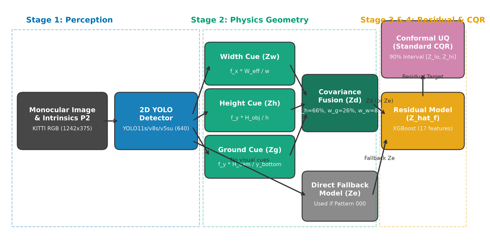

# Calibrated Hybrid Geometry–Learning Monocular Vehicle Distance Estimation with Lightweight YOLO Detectors

[](tests/)
[](requirements.txt)
[](https://pytorch.org/)
[](http://www.cvlibs.net/datasets/kitti/eval_object.php)
[](LICENSE)
[](docs/CHECKLIST_AUDIT.md)

This repository contains the official, fully reproducible implementation of the research project:  
**"Calibrated Hybrid Geometry–Learning Monocular Vehicle Distance Estimation with Lightweight YOLO Detectors"** (Course: DSR301m, Fall 2026).

The framework establishes a modular, physically grounded pipeline for monocular vehicle distance estimation in intelligent transportation systems (ITS) and advanced driver assistance systems (ADAS). It integrates **perspective pinhole geometry**, **covariance shrinkage fusion**, **gradient-boosted residual correction**, and **Conformalized Quantile Regression (CQR)** with strict finite-sample coverage validation.

---

## 🚀 Key Experimental Highlights (Held-Out Split T Benchmark)

Evaluated on the locked held-out test split (Split T: 1,102 frames, 10 drive clusters, $N_{\text{gt}} = 3,212$ Ground Truth Car Hard objects) using Greedy Matching ($\text{IoU} \ge 0.5$):

| Model Backbone | Ranging AbsRel | Delta1 ($\delta_1 < 1.25$) | Mean Abs Error (MAE) | Recall (Car Hard) | CQR Empirical Coverage ($\alpha=0.1$) | End-to-End Latency (RTX 5060 GPU) |
|---|:---:|:---:|:---:|:---:|:---:|:---:|
| **YOLO11s** | **0.0463** | **99.67%** | **1.10 m** | **84.43%** | **96.39%** | **37.99 ms (26.3 FPS)** |
| **YOLOv8s** | **0.0461** | **99.66%** | **1.11 m** | **82.81%** | **97.14%** | **32.05 ms (31.2 FPS)** |
| **YOLOv5su** | **0.0474** | **99.44%** | **1.15 m** | **83.25%** | **96.60%** | **33.01 ms (30.3 FPS)** |
| *Fused Geometry Baseline ($Z_d$)* | *0.0640* | *98.02%* | *1.41 m* | *—* | *—* | *+0.18 ms* |

- **Common Support Ranging ($N=2,528$ vehicles):** Distance estimation precision across the 3 YOLO detectors is practically identical (AbsRel: 0.0446 vs 0.0449 vs 0.0457, with all paired cluster bootstrap 95% CIs containing zero).
- **Hybrid Value Finding:** While the hybrid residual model (f) achieves comparable numerical precision to direct bounding box regression (e) ($\Delta = -0.0002$ [-0.0012, +0.0023], containing zero), its primary value resides in **transparent physical explainability**, **grounded error decomposition**, and **graceful fallback** under geometric invalidation.
- **Ultra-low Post-Detector Overhead:** The entire post-detector stack (Geometry + Residual XGBoost + CQR) incurs only **$\approx 1.35$ ms/image** ($< 4.2\%$ of total GPU execution time).

---

## 🏛️ System Architecture



1. **Lightweight Detector Stage:** YOLOv8s / YOLO11s / YOLOv5su predict 2D bounding boxes $(x_1, y_1, x_2, y_2)$ mapped back to raw KITTI image dimensions.
2. **Perspective Geometry & Shrinkage Fusion:** Three independent pinhole cues—Height ($Z_h$), Width ($Z_w$), and Ground Contact ($Z_g$)—are dynamically masked for boundary truncation ($\epsilon = 2\text{ px}$) and fused in log-space via non-negative least squares (NNLS) with Ledoit-Wolf/OAS shrinkage covariance weighting.
3. **Residual Learning Stage:** A gradient-boosted tree ensemble (XGBoost) predicts the log-ratio residual $\hat{r} = \ln Z_{\text{gt}} - \ln Z_{\text{base}}$ using 17 test-time observable features. A dedicated Direct Model ($Z_e$) serves as an automated fallback when all cues are masked (Pattern 000).
4. **Conformal Uncertainty Quantification (CQR):** Predicts 5% and 95% error quantiles ($\hat{q}_{0.05}, \hat{q}_{0.95}$) calibrated via conformal order statistics on Split C, yielding finite-sample prediction intervals $[Z_{\text{lo}}, Z_{\text{hi}}]$ with zero interval crossing violations.

---

## 📁 Repository Structure

```
Distance-Estimation-KITTI-YOLO/
│
├── configs/                       # Đóng băng cấu hình thí nghiệm
│   ├── detector/                 # Ngưỡng conf F1 (0.70/0.79/0.74), checkpoints SHA-256
│   ├── residual/                 # Cấu hình XGBoost (residual_prereg_v1.yaml)
│   ├── geometry_params.yaml      # Trọng số hợp nhất geometry-v2 [0.0807, 0.6634, 0.2560]
│   └── pipeline_frozen_v1.yaml   # Cấu hình nghiệm thu đóng băng v1.1
│
├── data/                          # KITTI data (raw & YOLO converted, gitignored)
├── splits/                        # Splits-v2 đóng băng theo drive (A/V/B/C/T, split_metadata.json)
│
├── src/                           # Mã nguồn lõi của thư viện
│   ├── detection/                # Greedy matching (IoU 0.5, 4 trạng thái), train helpers
│   ├── geometry/                 # Pinhole cues (Z_w, Z_h, Z_g), OAS shrinkage fusion
│   ├── residual/                 # Feature extraction (17 test-time features), XGBoost models
│   ├── uncertainty/              # CQR, Mondrian CQR, order statistic calibration
│   ├── evaluation/               # Metrics (AbsRel, MAE, Delta1), paired cluster bootstrap
│   └── pipeline/                 # apply_frozen.py, build_dataset.py
│
├── scripts/                       # Các kịch bản thực thi & xuất bản tự động
│   ├── build_numbers_manifest.py # Sinh results/final/numbers_manifest.json (81 metrics)
│   ├── export_final_tables.py    # Xuất 7 bảng CSV & LaTeX booktabs vào results/tables/final/
│   ├── export_final_figures.py   # Xuất 5 hình vẽ khoa học >= 300 DPI vào results/figures/final/
│   ├── render_manuscript.py      # Compile MANUSCRIPT_TEMPLATE.md -> MANUSCRIPT_DRAFT.md
│   ├── audit_checklist.py        # Kiểm toán tự động 14 tiêu chí §11 -> docs/CHECKLIST_AUDIT.md
│   └── run_final_T.py            # Runner nghiệm thu Split T độc lập có lockfile
│
├── tests/                         # Bộ kiểm thử đơn vị (237 unit tests pass 100%)
├── runs/                          # Runtime logs, checkpoints SHA, final_T.lock
├── results/                       # Kết quả xuất bản
│   ├── tables/final/             # 7 cặp bảng tab_01 .. tab_07 (.csv và .tex)
│   ├── figures/final/            # 5 hình xuất bản fig_01 .. fig_05 (.png >= 300 DPI)
│   └── final/                    # numbers_manifest.json, predictions tĩnh
│
└── docs/                          # Tài liệu & Báo cáo nghiên cứu
    ├── paper/                    # MANUSCRIPT_DRAFT.md, references.bib
    ├── presentation/             # SLIDES_OUTLINE.md (16 slide), MOCK_DEFENSE_QA.md
    ├── CHECKLIST_AUDIT.md        # Báo cáo kiểm toán độc lập (14/14 PASS)
    ├── KE_HOACH_V4.md            # Thiết kế nghiên cứu nền tảng
    └── NHAT_KY_QUYET_DINH.md     # Nhật ký quyết định khoa học (D01 - D120)
```

---

## 🛠️ Quickstart & Environment Setup

### 1. Cài đặt Môi trường
Yêu cầu Python 3.10+ và GPU hỗ trợ CUDA (khuyến nghị CUDA 12.8):
```bash
# Clone repository
git clone https://github.com/nguyenthang060706/Distance-Estimation-KITTI-YOLO.git
cd Distance-Estimation-KITTI-YOLO

# Cài đặt thư viện phụ thuộc
pip install -r requirements.txt
```

### 2. Kiểm thử Toàn bộ Hệ thống
Chạy bộ kiểm thử đơn vị hồi quy gồm 237 tests:
```bash
python -m pytest -q
# Kết quả mong đợi: 237 passed in ~60-65s
```

### 3. Tái lập Toàn bộ Bài báo và Bảng biểu (One-Command Reproduction)
Nhờ cơ chế lưu trữ kết quả tĩnh có mã băm SHA-256 đối chiếu và template placeholder chống ảo giác số liệu, bạn có thể tái lập lại 100% bảng LaTeX, biểu đồ và bản thảo bài báo mà không cần chạy lại mô hình nặng:

```bash
# 1. Trích xuất bản đồ số liệu chuẩn hóa (81 metrics)
python scripts/build_numbers_manifest.py

# 2. Xuất 7 bảng chính thức (CSV & LaTeX booktabs)
python scripts/export_final_tables.py

# 3. Xuất 5 biểu đồ khoa học 300 DPI
python scripts/export_final_figures.py

# 4. Biên dịch bản thảo bài báo khoa học
python scripts/render_manuscript.py

# 5. Chạy kiểm toán liêm chính học thuật 14 tiêu chí
python scripts/audit_checklist.py
```

---

## 📊 Tóm tắt Các Phát hiện Khoa học Chính

1. **Hiệu năng Cue Đơn lẻ vs Hợp nhất (RQ1):** Cue chiều cao $Z_h$ đạt độ chính xác cao nhất (AbsRel $0.0650$ trên B OOF); cue chiều rộng $Z_w$ suy biến mạnh khi nhìn ngang (AbsRel $0.2462$) do phình to thành chiều dài xe. Thuật toán NNLS tự động kẹp $w_w \to 0$ trên detector để loại bỏ nhiễu góc nhìn xe.
2. **So sánh Đa Thế hệ Detector (RQ2):** Trên 2.528 xe chung, cả 3 thế hệ YOLO (v5su, v8s, 11s) đều đạt độ chính xác tương đồng (AbsRel $\approx 0.045$). Tương quan giữa độ lệch cạnh đáy 2D và sai số khoảng cách gần như triệt tiêu ($|\rho| \le 0.10$).
3. **Bất định & Độ Phủ Conformal (RQ3):** CQR đạt độ phủ thực nghiệm **96.39% – 97.14%** (vượt mức danh nghĩa 90%). Sự bảo thủ ngoài mẫu này xuất phát từ việc tập hiệu chuẩn Split C có mức độ khó cao hơn Split T ($D_{\text{KS}} \approx 0.15$), mang lại biên an toàn an tâm cho hệ thống ADAS.
4. **Độ trễ Thời gian thực (RQ4):** Toàn bộ khâu hậu xử lý của mô hình lai chỉ tốn **1.35 ms** trên GPU RTX 5060, đạt tốc độ **26.3 FPS** trên GPU và **8.6 FPS** trên CPU 4 luồng.

---

## 🔍 Tính Minh Bạch & 14 Hạn Chế Cốt Lõi (Limitations)

Nghiên cứu cam kết liêm chính học thuật tuyệt đối và công khai toàn diện 14 hạn chế phương pháp luận:
- **Survivorship Bias:** Đánh giá có điều kiện trên True Positives; ở cự ly $30\text{--}50\text{ m}$, detector bỏ sót $\approx 48\text{--}50\%$ xe.
- **Dải xa $>50\text{ m}$ thưa thớt:** Ground Truth trên Split T chỉ có 33 xe, True Positives chỉ có $\le 9$ xe.
- **Tương quan Cụm:** Số cụm drive $k \le 12 < 20$, các khoảng Bootstrap CI mang tính chất thô.
- **Hiện tượng $(f) \approx (e)$:** Mô hình residual và hồi quy trực tiếp có khoảng tin cậy chồng lấn; giá trị của hybrid nằm ở tính khả giải thích vật lý và fallback an toàn.
- **Sửa lỗi Serialization v1.1:** Công khai việc quan sát kết quả v1 trước khi chuẩn hóa chuỗi `base_score` hậu kiểm mà không mở khóa Split T (`final_T.lock` bất biến 100%).

Chi tiết đầy đủ xem tại [docs/paper/MANUSCRIPT_DRAFT.md Section 6](docs/paper/MANUSCRIPT_DRAFT.md) và [docs/CHECKLIST_AUDIT.md](docs/CHECKLIST_AUDIT.md).

---

## 📚 Trích dẫn Khoa học (BibTeX Citation)

Nếu bạn sử dụng mã nguồn, dữ liệu hoặc phát hiện thực nghiệm của đề tài trong nghiên cứu, vui lòng trích dẫn:

```bibtex
@article{kitti_yolo_distance_2026,
  title   = {Calibrated Hybrid Geometry--Learning Monocular Vehicle Distance Estimation with Lightweight YOLO Detectors},
  author  = {Nguyen, Thang and Research Team},
  journal = {DSR301m Capstone Research Project, Fall 2026},
  year    = {2026},
  url     = {https://github.com/nguyenthang060706/Distance-Estimation-KITTI-YOLO}
}
```

---

## 📄 Bản quyền & Giấy phép (License)
Dự án được phân phối dưới giấy phép **MIT License**. Bộ dữ liệu KITTI thuộc bản quyền của Karlsruhe Institute of Technology & Toyota Technological Institute at Chicago.
